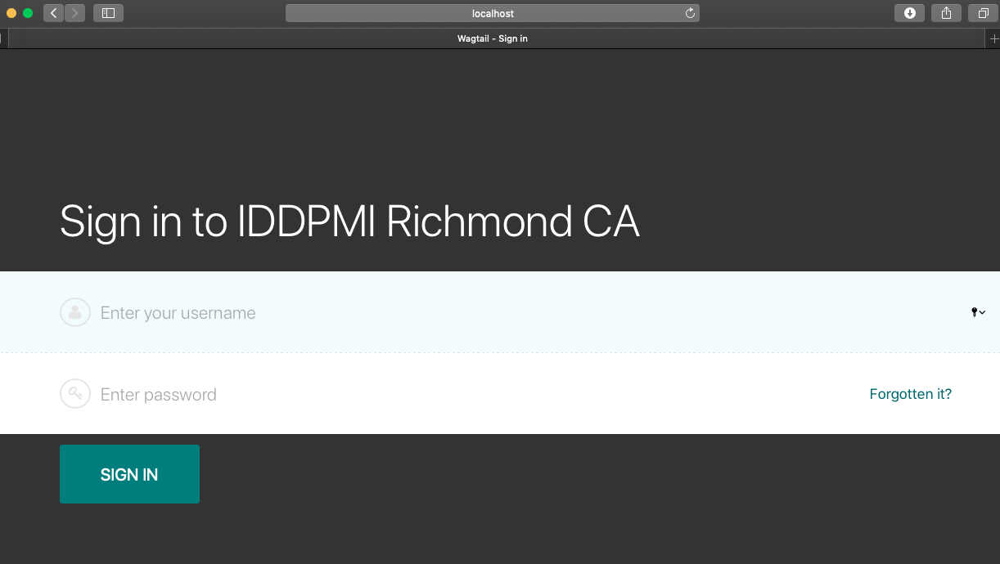
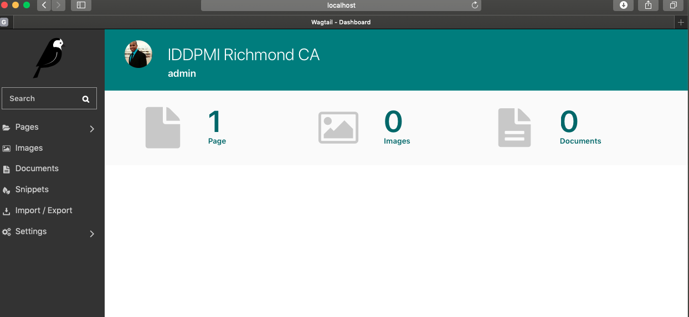

# www.iddpmirichmond.com
## Setup

###	Pre-requisites:
- Linux commandline knowledge
- Git Knowledge

### Mac Instructions

#### Mac Instructions: Install homebrew package manager:
- [https://brew.sh](https://brew.sh)

#### Mac Instructions: Install Python3

	$ brew install python3

#### Mac Instructions: Install Sublime Text 3
- Go to [https://www.sublimetext.com/3](https://www.sublimetext.com/3) and download the latest `OS X intaller`

### Windows Instructions

- What Do I Need?

	To effectively use Python on Windows, you need a few pieces of software:

	- Python
	- Cygwin
	- Sublime Text or another text editor

	Follow the instructions the below to set them up

	Also see for detailed reference: [https://www.davidbaumgold.com/tutorials/set-up-python-windows/](https://www.davidbaumgold.com/tutorials/set-up-python-windows/)

#### Windows Instructions: Download the latest python 3.x.x
- From [https://www.python.org/downloads/](https://www.python.org/downloads/) and install it. Use the `Windows x86-64 executable installer`. 
	- `For help reference instructions in` [https://www.davidbaumgold.com/tutorials/set-up-python-windows/](https://www.davidbaumgold.com/tutorials/set-up-python-windows/)

#### Windows Instructions: Install Cygwin
- From [https://cygwin.com/](https://cygwin.com/) download `setup.exe`, and run it.
	- Make sure to install the three packages mentioned on the instructions:
		- openssh
		- git
		- curl
			- `For help reference instructions in` [https://www.davidbaumgold.com/tutorials/set-up-python-windows/](https://www.davidbaumgold.com/tutorials/set-up-python-windows/)
	- Open Cygwin and test the installation of the packages:
		- ssh

			```
			$ ssh -V
			OpenSSH_8.2p1, OpenSSL 1.1.1d  10 Sep 2019
			```

		- git

			```
			$ git --version
			git version 2.21.0
			```
			- also configure you git email and username

				```
				$ git config --global user.email "you@example.com"
  				$ git config --global user.name "Your Name"
				```
				
		- curl

			```
			$ curl --version
			curl 7.66.0 (x86_64-pc-cygwin) ...
			...
			```
	- If you get any `command not found` error on the above commands it means you have to re-run the [https://cygwin.com/](https://cygwin.com/) download `setup.exe` and select to install the packages.

#### Windows Instructions: Install Sublime Text 3
- Go to [https://www.sublimetext.com/3](https://www.sublimetext.com/3) and download the latest `Windows 64 bit intaller`
	- `For help reference instructions in` [https://www.davidbaumgold.com/tutorials/set-up-python-windows/](https://www.davidbaumgold.com/tutorials/set-up-python-windows/)


#### Windows Instructions: Test your python installation
- `For help reference instructions in` [https://www.davidbaumgold.com/tutorials/set-up-python-windows/](https://www.davidbaumgold.com/tutorials/set-up-python-windows/)

	Run the commands below to test your python installation

	```
	python -c 'print("Hello, World!")'
	Hello, World!
	``` 
- If that works, lets move on to writing a program into a file. Open up Sublime Text, and type in the following:
	
	```
	#!/usr/bin/env python
	print("Hello, World!")
	```
	
	Save the file in your home directory (inside of C:\cygwin\home) as hello.py. 

	Then open up the Terminal, cd to that directory, and run:
	
	```
	$ chmod a+x hello.py
	$ ./hello.py
	Hello, World!
	```

	And you should see the same Hello, World! output that you saw before. 
	
	Congratulations, you're ready to start learning Python!

### Set Github ssh key
- Follow the instructions on: [https://help.github.com/en/github/authenticating-to-github/generating-a-new-ssh-key-and-adding-it-to-the-ssh-agent](https://help.github.com/en/github/authenticating-to-github/generating-a-new-ssh-key-and-adding-it-to-the-ssh-agent)

### Create the directories to store our github source code

```
$ cd
$ mkdir -p source/github.com/iddpmirichmondca/
```

### Dowload the church-website repo 

```
$ cd  source/github.com/iddpmirichmondca/
$ git clone git@github.com:iddpmirichmondca/church-website.git
$ git clone git@github.com:iddpmirichmondca/church-website.git
Cloning into 'church-website'...
The authenticity of host 'github.com (140.82.113.4)' can't be established.
RSA key fingerprint is SHA256:nThbg6kXUpJWGl7E1IGOCspRomTxdCARLviKw6E5SY8.
Are you sure you want to continue connecting (yes/no/[fingerprint])? yes
Warning: Permanently added 'github.com,140.82.113.4' (RSA) to the list of known hosts.
remote: Enumerating objects: 66, done.
remote: Counting objects: 100% (66/66), done.
remote: Compressing objects: 100% (50/50), done.
remote: Total 66 (delta 14), reused 53 (delta 7), pack-reused 0
Receiving objects: 100% (66/66), 192.41 KiB | 791.00 KiB/s, done.
Resolving deltas: 100% (14/14), done.
```

### Create a Python3 Virtual Environment inside church-website repo

- change directory to the church-website repo

```	
$ cd church-website
```

- Create python virtual environment for the project
	- Mac

		```
		$ python3 -m venv .venv
		```

		This will create the .venv directory if it doesn’t exist, and also create directories inside it containing a copy of the Python interpreter, the standard library, and various supporting files.

		- Activate the virtual environment

			```
			$ source .venv/bin/activate
			```

		- Install all required packages

			```
			(.venv) $ pip install -r requirements.txt
			```

		- Run website locally

			```
			(.venv) $ cd mysite/
			(.venv) $ python manage.py migrate
   			(.venv) $ python manage.py runserver
   			```
	- Windows

		You'll need to open a Windows PowerShell in order tu run your python virtual environment.

		```
		PS set-executionpolicy remotesigned 
		PS cd C:\cygwin64\home\colon\source\github.com\iddpmirichmondca\church-website\
		PS .\.venv\Scripts\Activate.ps1
		(.venv) PS
		pip install -r .\requirements.txt
		```
		WIP


### Access your local copy
- **Website:** [http://localhost:8000](http://localhost:8000)
	- Website: 

- **Admin:** [http://localhost:8000/admin](http://localhost:8000/admin)
	- Admin sign in:

	- Admin panel
 

### Shutdown local running website
- Press `control` + `c` key to shutdown local server