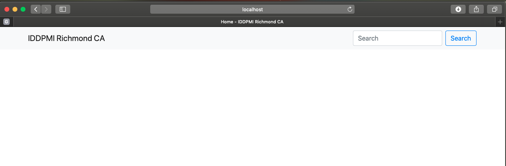

# www.iddpmirichmond.com
## Setup

###	Pre-requisites:
- Linux commandline knowledge
- Git Knowledge

### MAC

#### Install homebrew package manager:
- [https://brew.sh](https://brew.sh)

#### Install Python3

	$ brew install python3

#### Dowload the church-website repo 

IMPORTANT: Please note that download with your own account you must be invited as a contributor because, the repo is private.

	$ git clone git@github.com:iddpmirichmond/church-website.git

#### Create a Python3 Virtual Environment inside church-website repo

- change dircetory to the church-website repo

		$ cd church-website # change directory to the church-website repo

- Create python virtual environment for the project

		$ python3 -m venv .venv # create a .venv folder 

	This will create the .venv directory if it doesn’t exist, and also create directories inside it containing a copy of the Python interpreter, the standard library, and various supporting files.

- Activate the virtual environment

	
		$ source .venv/bin/activate
	

#### Install all required packages

	(.venv) $ pip install -r requirements.txt

#### Run website locally

	(.venv) $ cd mysite/
	(.venv) $ python manage.py migrate
   	(.venv) $ python manage.py runserver

#### Access your local copy
- **Website:** [http://localhost:8000](http://localhost:8000)
- 
- **Admin:** [http://localhost:8000/admin](http://localhost:8000/admin)
- 
-  

#### Shutdown local running website
- Press `control` + `c` key to shutdown local server
- 